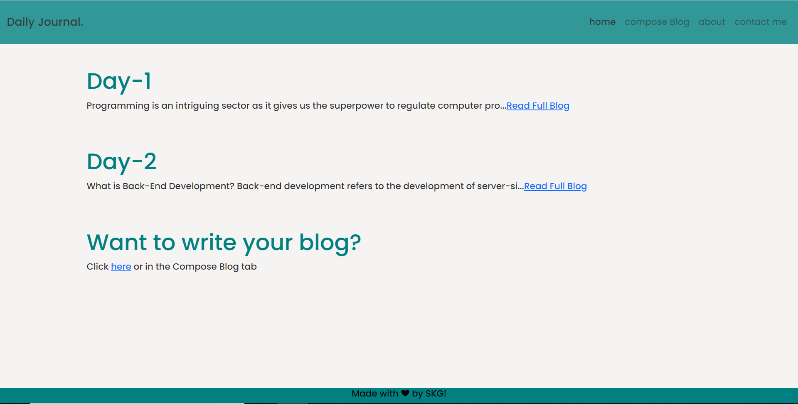
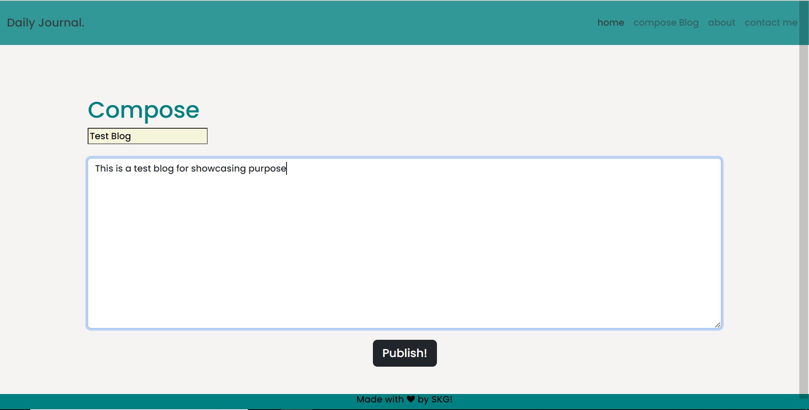
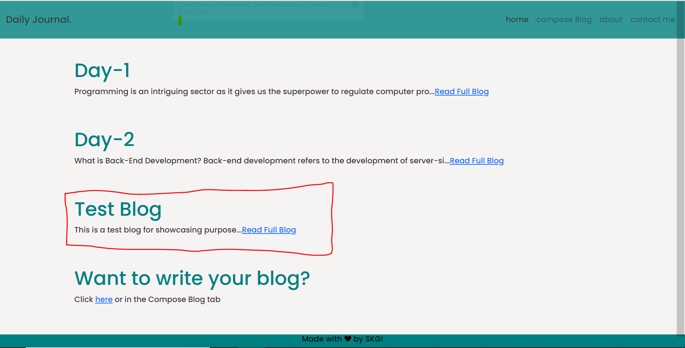
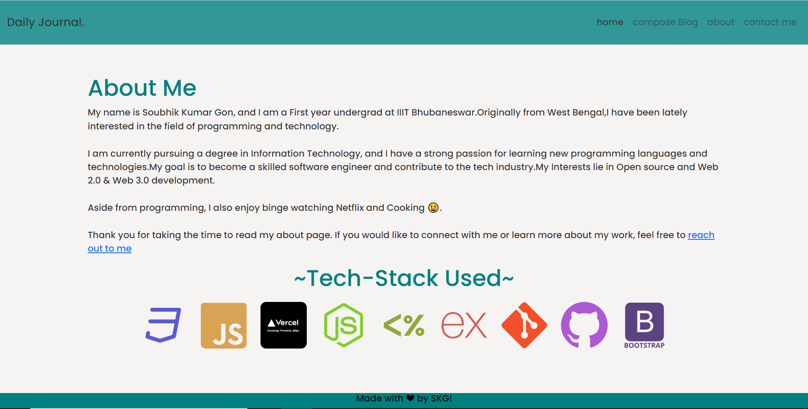
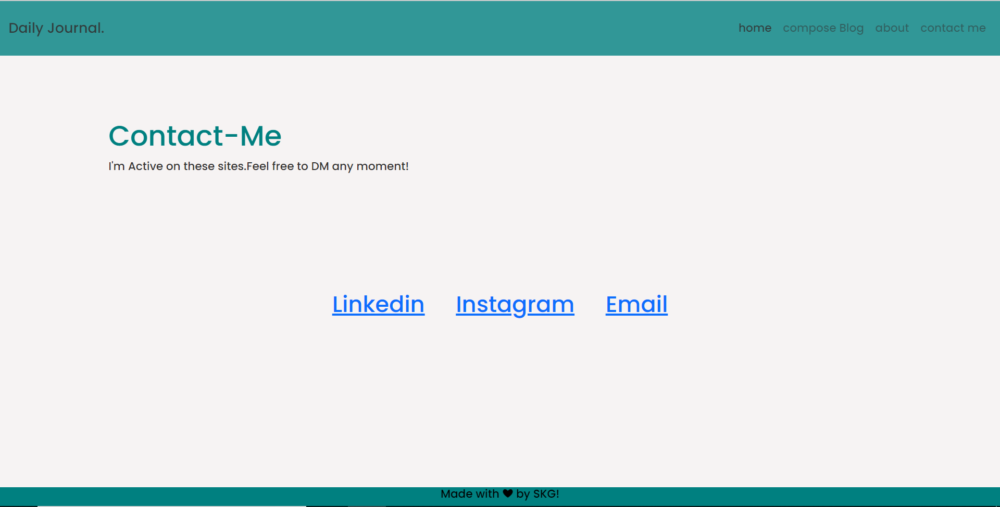

# Blog-website

### A blog website which helps user to read blogs and write their own blogs.

to run it on your machine:
- Fork the repo
- install the dependencies
- in the console: `node app.js`

# Home Page

- After writing the blog and Publishing it:

# About page

# Contact page

